<style>
img {
	max-width:99%;
}
a {
  color: blue;
}
pre {
  font: inherit;
  word-wrap: break-word;
  background: none;
  border: none;
}
code {
  font-size: 10px;
}
</style>

# Development.dukeupress.edu Homepage Assessment

__<https://development.dukeupress.edu/>__

__Screenshot:__

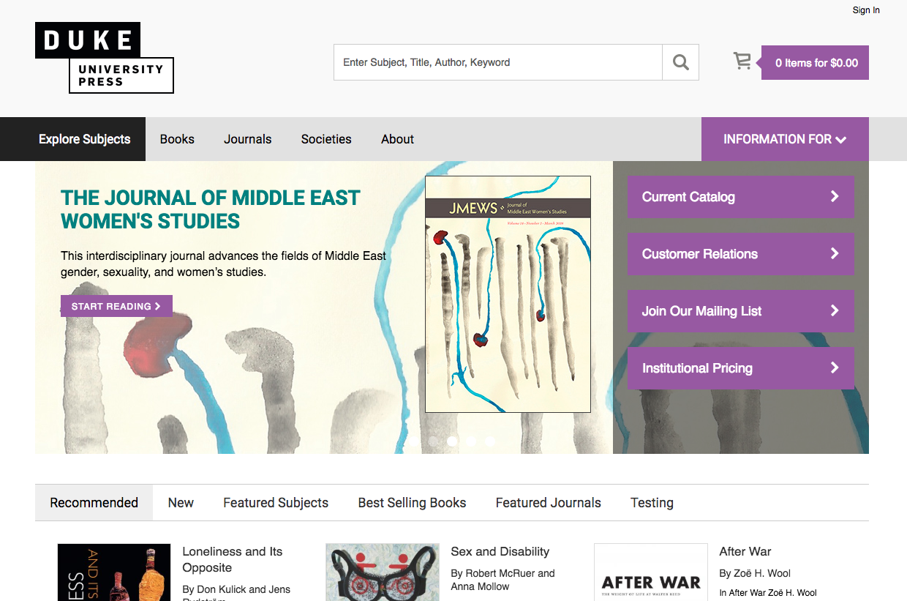


## Accessibility

### Interactive controls are not keyboard focusable [priority]
Custom interactive controls are keyboard focusable and display a focus indicator. [Learn more](https://developers.google.com/web/fundamentals/accessibility/how-to-review#start_with_the_keyboard).

Issue:

To debug other issues in this document, the focus indicator will need restored. The focus indicator is hidden using outline:none. This means that no keyboard-only user can use the website.

```html
a, a:hover, a:focus, a:active, a.active {
    outline: 0;
    text-decoration: none;
}
```

__`Outline:0`__ must be removed in all stylesheets.

Is also required that any interactive element can have focus, and that any element that has focus can be activated via the keyboard.

<br>
<br>
<hr>

### The user's focus is not directed to new content added to the page [priority]
If new content, such as a dialog, is added to the page, the user's focus is directed to it. [Learn more](https://developers.google.com/web/fundamentals/accessibility/how-to-review#start_with_the_keyboard).

Issue:

The dropdown menus are missing aria attributes. Keyboard only users can not use the website.

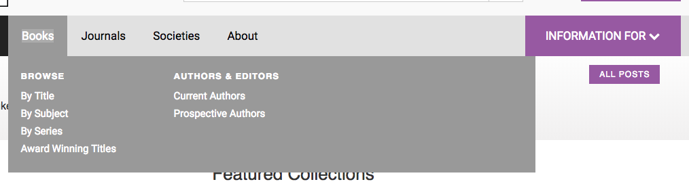

This site is using already Bootstrap. The Bootstrap 3 dropdown menu is accessible. Consider replacing with that menu with the accessibility options added. If that is not an option, we have some JS code snippets that can help fix the existing menu upon request.

<br>
<br>
<hr>

### The slideshow carousel is not screen reader accessible [priority]
Inaccessible Carousels are the  most difficult and most time consuming issue on any website. 

Keyboard accessibility is one of the most important aspects of web accessibility. Many users with motor disabilities rely on a keyboard. Blind users also typically use a keyboard for navigation. Some people have tremors which don't allow for fine muscle control. [Learn more](https://webaim.org/techniques/keyboard/)

#### Visual location:
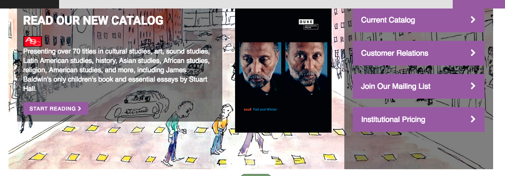

An auto advancing slideshow breaks one of the most important rules of usability and accessiblity. _"Don't make the page do something the user did not ask it to do."_ However they are not explicitly outlawed by WCAG 2.0 AA. It is possible to make it accessible.  


### What makes a carousel accessible?

* Users must be able to pause carousel movement because it can be too fast or distracting, making text hard to read.
* All functionality, including navigating between carousel items, must be operable by keyboard.
* Changes to carousel items must be communicated to all users, including screen reader users.
* The keyboard position (“focus”) is managed in a reasonable and comprehensible fashion.
* Note: Carousels are disputed from a usability perspective because their content can be hard to discover. Ensuring accessibility can also improve usability.

### Why is this important?
Typically, carousels are prominently located and are used to provide navigation or show page content. Accessible carousels are essential for many website users including:

* People using keyboard navigation and voice input software can navigate between individual items.
* People using screen readers will understand which item is currently shown and how to navigate between items.
* People who are distracted by movement can pause animations.
* People who need more time to read can pause animations, providing them with sufficient time to read and understand carousel content.


#### To fix this slideshow:

##### 1) Add missing play/pause button. 
For full WCAG 2.0 compliance Carousels are not allowed to auto-advance. 

If the website chooses to keep the autoadvance functionality, it must have a pause button. 


##### 2) Controls can not be hidden. 
Currently the user must hover over the carousel to see the next and back buttons/links with a mouse. Some people cannot use a mouse, so they would never know they could control it. They need to be visible at all times.

###### Visual location:

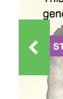
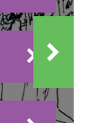

##### 3) Add the appropriate ARIA attributes.

Retrofiting ARIA attributes like aria-hidden on hidden slides. 


#### _My Advice_

Because of the inherit usability and accessibility issues all slideshow provide, I always recommend removing them. Removing it will take less time than it will take to fix all the errors. This might be possible by having only one slide in the rotator, depending on its configuration.

As an alternative, sometimes people put the banners in a schedule, so each day or each week they change. It keeps the content fresh without needing to update it. I submit to you that changing a static banner often, or putting them on a schedule will probably result in more interest in the content overall and result in more clicks.

Some studies show that 89% of rotating banner clicks are on the first slide. So people rarely see the second slide.  If the slideshow does not auto-rotate I expect the number is even lower.

<br>
<hr>
<hr>
<br>

### `[aria-*]` attributes do not have valid values x 8+ 
Assistive technologies, like screen readers, can't interpret ARIA attributes with invalid values. [Learn more](https://dequeuniversity.com/rules/axe/2.2/aria-valid-attr-value?application=lighthouse).

This is related to the rotating banner. It is invalid because `aria-describedby` references `slick-slide00` which does not exist.

This error is repeated on all 8 slides in this Slick slider

#### Visual location:

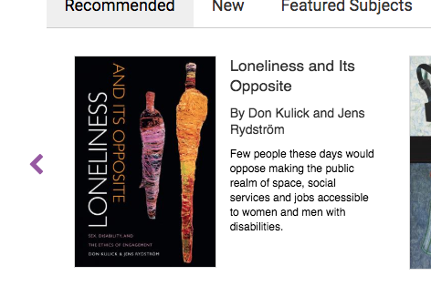


#### HTML location:

```html
<a href="/Products/Books/Loneliness-and-Its-Opposite" class="slick-slide slick-current slick-active" data-slick-index="0" aria-hidden="false" tabindex="-1" role="option" aria-describedby="slick-slide00" style="width: 367px;">
```

<details>
<summary>__Additional debugging details__</summary>

_Selector path:_ <br> `a[aria-describedby="slick-slide00"]`

</details>

<br>
<br>
<hr>

### `[id]` attributes on the page are not unique x 5
The value of an id attribute must be unique to prevent other instances from being overlooked by assistive technologies. [Learn more](https://dequeuniversity.com/rules/axe/2.2/duplicate-id?application=lighthouse).

Every menu "Books", "Journals", "Societies", "About" and "Information For" use the ID `menuElem`. ID stands for unique identifier. Some assistive technologies might not be able to use the menu.

It can also cause JS errors for any user because the behavior may try to run on the wrong ID.

#####Visual location:

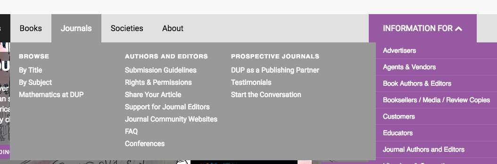

#####HTML location:

```html
<ul id="menuElem">
  <li></li>
  ...
</ul>
```


1. Check if the page needs that ID for CSS for visual reasons.
2. Check if the page needs that ID for JS for interactive behaviours.
3. If it needs the IDs edit the dependent code, then remove duplicate IDs from the HTML.

<details>
<summary>__Additional debugging details__</summary>

_Selector path:_ <br> `[u'.information-for-list1 > ul']`

_DOM path:_ <br>
`1,HTML,1,BODY,3,FORM,19,DIV,1,DIV,0,DIV,0,DIV,1,UL,0,LI,1,DIV,0,UL`
</details>
<hr>

<br>
<br>
<hr>
### Links do not have a discernible name x 14+
Link text (and alternate text for images, when used as links) that is discernible, unique, and focusable improves the navigation experience for screen reader users. [Learn more](https://dequeuniversity.com/rules/axe/2.2/link-name?application=lighthouse).


Screen reader users do not read webpages from top to bottom. They skip around by browsing Headings and Links.  

Two common problems:

1) "Read More" - If a screen reader comes accross a link that says "Read More" that is all the screen reader will read. Without context, the user asks "Read More" what?

If it must read "Read More" or "Learn More" it is possible to add invisble screen reader only text in the button element.<br>

```html
<a href="a/link.html">
  Read More
  <span class="sr-only"> 
    about whatever the topic is
  </span>
</a>
```

2) Empty links - No text in a link will read nothing to a screen reader. Making the link unidentifiable. This results in a screen reader person not having access to whatever information or behavior was intended. 

```html
<a href="a/link.html">
  <span class="icon-search"></span>
</a>
``` 

These 14 errors are a combination of those issues.


#### Search icon link

#####Visual location:

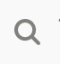

#####HTML location:

```html
<a href="/Special-Pages/Search"><span class="icon-search"></span></a>
```

<br>

<details>
<summary>__Additional debugging details__</summary>

_Selector path:_ <br> `[u'li:nth-child(1) > a[href$="Search"]']`

_DOM path:_ <br>
`1,HTML,1,BODY,3,FORM,19,DIV,0,DIV,0,DIV,1,DIV,1,DIV,0,UL,0,LI,0,A`

_Summary:_ <br>
Fix all of the following:
  Element is in tab order and does not have accessible text

Fix any of the following:
  Element does not have text that is visible to screen readers
  aria-label attribute does not exist or is empty
  aria-labelledby attribute does not exist, references elements that do not exist or references elements that are empty or not visible
  Element's default semantics were not overridden with role="presentation"
  Element's default semantics were not overridden with role="none"
</details>
<hr>


#### Shopping cart link

#####Visual location:

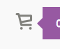

#####HTML location:

```html
<a href="/Special-Pages/Checkout/Shopping-Cart"><span class="icon-cart"></span></a>
```

<br>

<details>
<summary>__Additional debugging details__</summary>

_Selector path:_ <br> `[u'li:nth-child(2) > a[href$="Shopping-Cart"]']`

_DOM path:_ <br>
`1,HTML,1,BODY,3,FORM,19,DIV,0,DIV,0,DIV,1,DIV,1,DIV,0,UL,1,LI,0,A`

_Summary:_ <br>
Fix all of the following:
  Element is in tab order and does not have accessible text

Fix any of the following:
  Element does not have text that is visible to screen readers
  aria-label attribute does not exist or is empty
  aria-labelledby attribute does not exist, references elements that do not exist or references elements that are empty or not visible
  Element's default semantics were not overridden with role="presentation"
  Element's default semantics were not overridden with role="none"
</details>
<hr>


#### Blank Flexslider previous and back button

##### Visual location:


#####HTML location:

```html
<ul class="flex-direction-nav">
  <li>
    <a class="flex-prev" href="#">
    </a>
  </li>
  <li>
    <a class="flex-next" href="#">
    </a>
  </li>
</ul>
```

<br>
<hr>

#### Hidden extraneous link

This is related to the rotating banner.

#####Visual location:

Hidden behind slideshow

#####HTML location:

```html
<a href=""> <!--<i class="fa fa-chevron-right" aria-hidden="true"></i>--></a>
```

<br>

<details>
<summary>__Additional debugging details__</summary>

_Selector path:_ <br> `[u'#form > section > .wrapper > .slider > .container > .row > div > .flexslider > ul:nth-child(1) > li:nth-child(1) > .slide-content > .container > .row > .slide-box > .row > div:nth-child(1) > .slide-copy > .slider-link > a']`

_DOM path:_ <br>
`1,HTML,1,BODY,3,FORM,21,SECTION,0,DIV,0,DIV,0,DIV,0,DIV,0,DIV,0,DIV,0,UL,0,LI,1,DIV,0,DIV,0,DIV,0,DIV,0,DIV,0,DIV,0,DIV,3,SPAN,0,A`

_Summary:_ <br>
Fix all of the following:
  Element is in tab order and does not have accessible text

Fix any of the following:
  Element does not have text that is visible to screen readers
  aria-label attribute does not exist or is empty
  aria-labelledby attribute does not exist, references elements that do not exist or references elements that are empty or not visible
  Element's default semantics were not overridden with role="presentation"
  Element's default semantics were not overridden with role="none"
</details>
<hr>


#### Hidden extraneous link

This is related to the rotating banner.

#####Visual location:

Hidden behind slideshow

#####HTML location:

```html
<a href=""> <!--<i class="fa fa-chevron-right" aria-hidden="true"></i>--></a>
```

<br>

<details>
<summary>__Additional debugging details__</summary>

_Selector path:_ <br> `[u'#form > section > .wrapper > .slider > .container > .row > div > .flexslider > ul:nth-child(1) > li:nth-child(2) > .slide-content > .container > .row > .slide-box > .row > div:nth-child(1) > .slide-copy > .slider-link > a']`

_DOM path:_ <br>
`1,HTML,1,BODY,3,FORM,21,SECTION,0,DIV,0,DIV,0,DIV,0,DIV,0,DIV,0,DIV,0,UL,1,LI,1,DIV,0,DIV,0,DIV,0,DIV,0,DIV,0,DIV,0,DIV,3,SPAN,0,A`

_Summary:_ <br>
Fix all of the following:
  Element is in tab order and does not have accessible text

Fix any of the following:
  Element does not have text that is visible to screen readers
  aria-label attribute does not exist or is empty
  aria-labelledby attribute does not exist, references elements that do not exist or references elements that are empty or not visible
  Element's default semantics were not overridden with role="presentation"
  Element's default semantics were not overridden with role="none"
</details>
<hr>


#### Hidden extraneous link

This is related to the rotating banner.

#####Visual location:

Hidden behind slideshow

#####HTML location:

```html
<a href=""> <!--<i class="fa fa-chevron-right" aria-hidden="true"></i>--></a>
```

<br>

<details>
<summary>__Additional debugging details__</summary>

_Selector path:_ <br> `[u'#form > section > .wrapper > .slider > .container > .row > div > .flexslider > ul:nth-child(1) > li:nth-child(3) > .slide-content > .container > .row > .slide-box > .row > div:nth-child(1) > .slide-copy > .slider-link > a']`

_DOM path:_ <br>
`1,HTML,1,BODY,3,FORM,21,SECTION,0,DIV,0,DIV,0,DIV,0,DIV,0,DIV,0,DIV,0,UL,2,LI,1,DIV,0,DIV,0,DIV,0,DIV,0,DIV,0,DIV,0,DIV,3,SPAN,0,A`

_Summary:_ <br>
Fix all of the following:
  Element is in tab order and does not have accessible text

Fix any of the following:
  Element does not have text that is visible to screen readers
  aria-label attribute does not exist or is empty
  aria-labelledby attribute does not exist, references elements that do not exist or references elements that are empty or not visible
  Element's default semantics were not overridden with role="presentation"
  Element's default semantics were not overridden with role="none"
</details>
<hr>


#### Hidden extraneous link

This is related to the rotating banner.

#####Visual location:

Hidden behind slideshow

#####HTML location:

```html
<a href=""> <!--<i class="fa fa-chevron-right" aria-hidden="true"></i>--></a>
```

<br>

<details>
<summary>__Additional debugging details__</summary>

_Selector path:_ <br> `[u'#form > section > .wrapper > .slider > .container > .row > div > .flexslider > ul:nth-child(1) > li:nth-child(4) > .slide-content > .container > .row > .slide-box > .row > div:nth-child(1) > .slide-copy > .slider-link > a']`

_DOM path:_ <br>
`1,HTML,1,BODY,3,FORM,21,SECTION,0,DIV,0,DIV,0,DIV,0,DIV,0,DIV,0,DIV,0,UL,3,LI,1,DIV,0,DIV,0,DIV,0,DIV,0,DIV,0,DIV,0,DIV,3,SPAN,0,A`

_Summary:_ <br>
Fix all of the following:
  Element is in tab order and does not have accessible text

Fix any of the following:
  Element does not have text that is visible to screen readers
  aria-label attribute does not exist or is empty
  aria-labelledby attribute does not exist, references elements that do not exist or references elements that are empty or not visible
  Element's default semantics were not overridden with role="presentation"
  Element's default semantics were not overridden with role="none"
</details>
<hr>


#### Hidden extraneous link

This is related to the rotating banner.

#####Visual location:

Hidden behind slideshow

#####HTML location:

```html
<a href=""> <!--<i class="fa fa-chevron-right" aria-hidden="true"></i>--></a>
```

<br>

<details>
<summary>__Additional debugging details__</summary>

_Selector path:_ <br> `[u'#form > section > .wrapper > .slider > .container > .row > div > .flexslider > ul:nth-child(1) > li:nth-child(5) > .slide-content > .container > .row > .slide-box > .row > div:nth-child(1) > .slide-copy > .slider-link > a']`

_DOM path:_ <br>
`1,HTML,1,BODY,3,FORM,21,SECTION,0,DIV,0,DIV,0,DIV,0,DIV,0,DIV,0,DIV,0,UL,4,LI,1,DIV,0,DIV,0,DIV,0,DIV,0,DIV,0,DIV,0,DIV,3,SPAN,0,A`

_Summary:_ <br>
Fix all of the following:
  Element is in tab order and does not have accessible text

Fix any of the following:
  Element does not have text that is visible to screen readers
  aria-label attribute does not exist or is empty
  aria-labelledby attribute does not exist, references elements that do not exist or references elements that are empty or not visible
  Element's default semantics were not overridden with role="presentation"
  Element's default semantics were not overridden with role="none"
</details>
<hr>


#### Links in the grey band x 5:

#####Visual location:

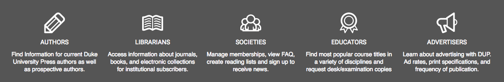

#####HTML location:

```html
<div class="latest-content">
  ...
  <div class="latest">
    
	<div class="title">Open Access at Duke University Press: Blog Series Highlights</div>
	<a href="/About/News/OPEN-ACCESS-AT-DUKE-UNIVERSITY-PRESS-BLOG-SERIES"></a> 
  </div>
</div>
```


<details>
<summary>__Additional debugging details__</summary>
_Summary:_ <br>
Fix all of the following:
  Element is in tab order and does not have accessible text

Fix any of the following:
  Element does not have text that is visible to screen readers
  aria-label attribute does not exist or is empty
  aria-labelledby attribute does not exist, references elements that do not exist or references elements that are empty or not visible
  Element's default semantics were not overridden with role="presentation"
  Element's default semantics were not overridden with role="none"
</details>
<hr>


#### Latest News

#####Visual location:

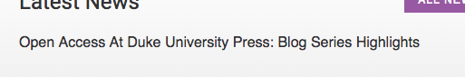

#####HTML location:

```html
<a href="/About/News/OPEN-ACCESS-AT-DUKE-UNIVERSITY-PRESS-BLOG-SERIES"></a>
```

<br>

<details>
<summary>__Additional debugging details__</summary>

_Selector path:_ <br> `[u'#form > section > .wrapper > .gradient-gray > .container > .row > div:nth-child(1) > .latest-content > .latest > a']`

_DOM path:_ <br>
`1,HTML,1,BODY,3,FORM,21,SECTION,0,DIV,3,DIV,0,DIV,0,DIV,0,DIV,0,DIV,1,DIV,1,A`

_Summary:_ <br>
Fix all of the following:
  Element is in tab order and does not have accessible text

Fix any of the following:
  Element does not have text that is visible to screen readers
  aria-label attribute does not exist or is empty
  aria-labelledby attribute does not exist, references elements that do not exist or references elements that are empty or not visible
  Element's default semantics were not overridden with role="presentation"
  Element's default semantics were not overridden with role="none"
</details>
<hr>

#### Latest blog posts

#####Visual location:

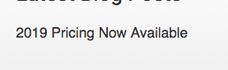

#####HTML location:

```html
<a href="https://dukeupress.wordpress.com/2018/06/05/2019-pricing-now-available/"></a>
```

<br>

<details>
<summary>__Additional debugging details__</summary>

_Selector path:_ <br> `[u'#form > section > .wrapper > .gradient-gray > .container > .row > div:nth-child(2) > .latest-content-last > .latest > a']`

_DOM path:_ <br>
`1,HTML,1,BODY,3,FORM,21,SECTION,0,DIV,3,DIV,0,DIV,0,DIV,2,DIV,0,DIV,1,DIV,1,A`

_Summary:_ <br>
Fix all of the following:
  Element is in tab order and does not have accessible text

Fix any of the following:
  Element does not have text that is visible to screen readers
  aria-label attribute does not exist or is empty
  aria-labelledby attribute does not exist, references elements that do not exist or references elements that are empty or not visible
  Element's default semantics were not overridden with role="presentation"
  Element's default semantics were not overridden with role="none"
</details>
<hr>


## Some background and foreground colors do not have a sufficient contrast ratio.
Low-contrast text is difficult or impossible for many users to read. [Learn more](https://dequeuniversity.com/rules/axe/2.2/color-contrast?application=lighthouse).

This is actually a false positive. However even false positives have been used to support the claim of a website being innaccessible. So they need remediated.

#####Visual location:
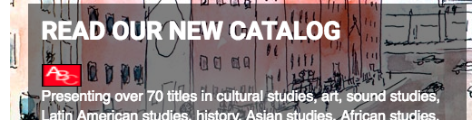

##### HTML location:
In the Flexslider.

To make the false positive go away. Try something like this:

```css
.slide-background {
  background-color: #000
}
```
<br>
<br>
<hr>
### The page has a logical tab order
Tabbing through the page follows the visual layout. Users cannot focus elements that are offscreen. [Learn more](https://developers.google.com/web/fundamentals/accessibility/how-to-review#start_with_the_keyboard).

Success.

<br>
<br>
<hr>


### User focus is not accidentally trapped in a region
A user can tab into and out of any control or region without accidentally trapping their focus. [Learn more](https://developers.google.com/web/fundamentals/accessibility/how-to-review#start_with_the_keyboard).

Success.

<br>
<br>
<hr>
### Custom controls have associated labels
Custom interactive controls have associated labels, provided by aria-label or aria-labelledby. [Learn more](https://developers.google.com/web/fundamentals/accessibility/how-to-review#try_it_with_a_screen_reader).

Issue: 

Problems here might be remediatied by performing fixes from "`[aria-*]` attributes do not have valid values". This will need rechecked after all the other ARIA work is done to ensure new issues were not added in the remediation processs.

<br>
<br>
<hr>
### Custom controls have ARIA roles
Custom interactive controls have appropriate ARIA roles. [Learn more](https://developers.google.com/web/fundamentals/accessibility/how-to-review#try_it_with_a_screen_reader).

Issue:

Problems here might be remediatied by performing fixes from "`[aria-*]` attributes do not have valid values". This will need rechecked after all the other ARIA work is done to ensure new issues were not added in the remediation processs.

<br>
<br>
<hr>
### Visual order on the page follows DOM order
DOM order matches the visual order, improving navigation for assistive technology. [Learn more](https://developers.google.com/web/fundamentals/accessibility/how-to-review#try_it_with_a_screen_reader).

Success.
<br>
<br>
<hr>
### Offscreen content is hidden from assistive technology
Offscreen content is hidden with display: none or aria-hidden=true. [Learn more](https://developers.google.com/web/fundamentals/accessibility/how-to-review#try_it_with_a_screen_reader).

Issue:

Problems here are generated by the Flexslider. Performing those fixes will fix this issue.

<br>
<br>
<hr>
### Headings don't skip levels
Headings are used to create an outline for the page and heading levels are not skipped. [Learn more](https://developers.google.com/web/fundamentals/accessibility/how-to-review#take_advantage_of_headings_and_landmarks).

Success.

<br>
<br>
<hr>
### HTML5 landmark elements are used to improve navigation
Landmark elements `(<main>, <nav>, etc.)` are used to improve the keyboard navigation of the page for assistive technology. [Learn more](https://developers.google.com/web/fundamentals/accessibility/how-to-review#take_advantage_of_headings_and_landmarks).

Issue:

Consider wrapping the header in a `<header>` tag, navigation in a `<nav>` tag, main content in a `<main>` tag, and footer in a `<footer>` tag.

This makes the page much easier for screen readers to navigate and skip sections.
<br>
<br>
<hr>


## How was this report created?
This report is partially generated by [Chrome Lighthouse](https://developers.google.com/web/tools/lighthouse/), [aXe Accessibility](https://chrome.google.com/webstore/detail/axe/lhdoppojpmngadmnindnejefpokejbdd?hl=en-US) extention, [WAVE](https://chrome.google.com/webstore/detail/wave-evaluation-tool/jbbplnpkjmmeebjpijfedlgcdilocofh), and manual tests indicated in this document. To ensure the entire website is fixed, rechecking the work in those three tools will be a good indication of successful remediation.